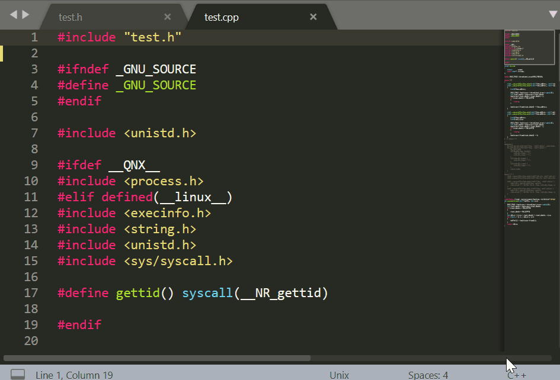
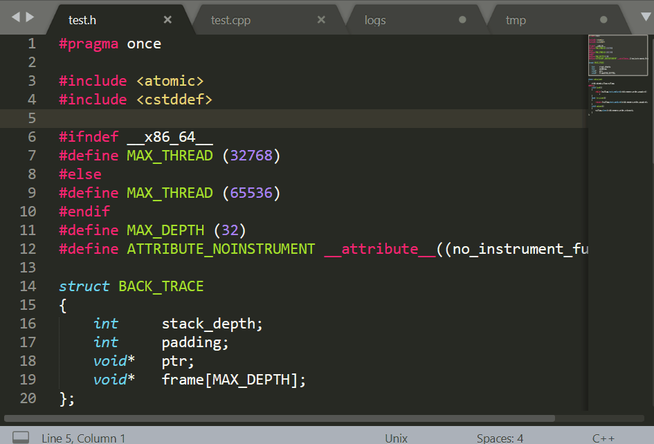
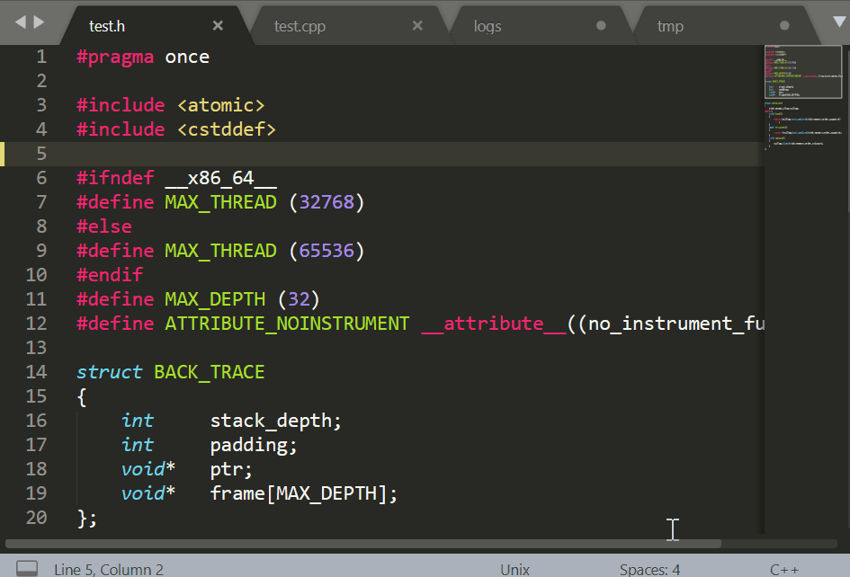

# BetterSave
Sublime plugin to save all files with filenames that exist on disk, and close all files without valid files without saving

## Prune all
Close all files **without an associated file on disk** without saving.

## Save all
Only save files **with an associated file on disk**.

Before:

After:

